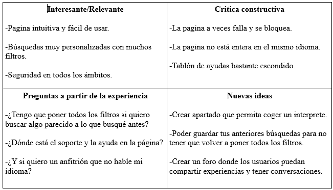
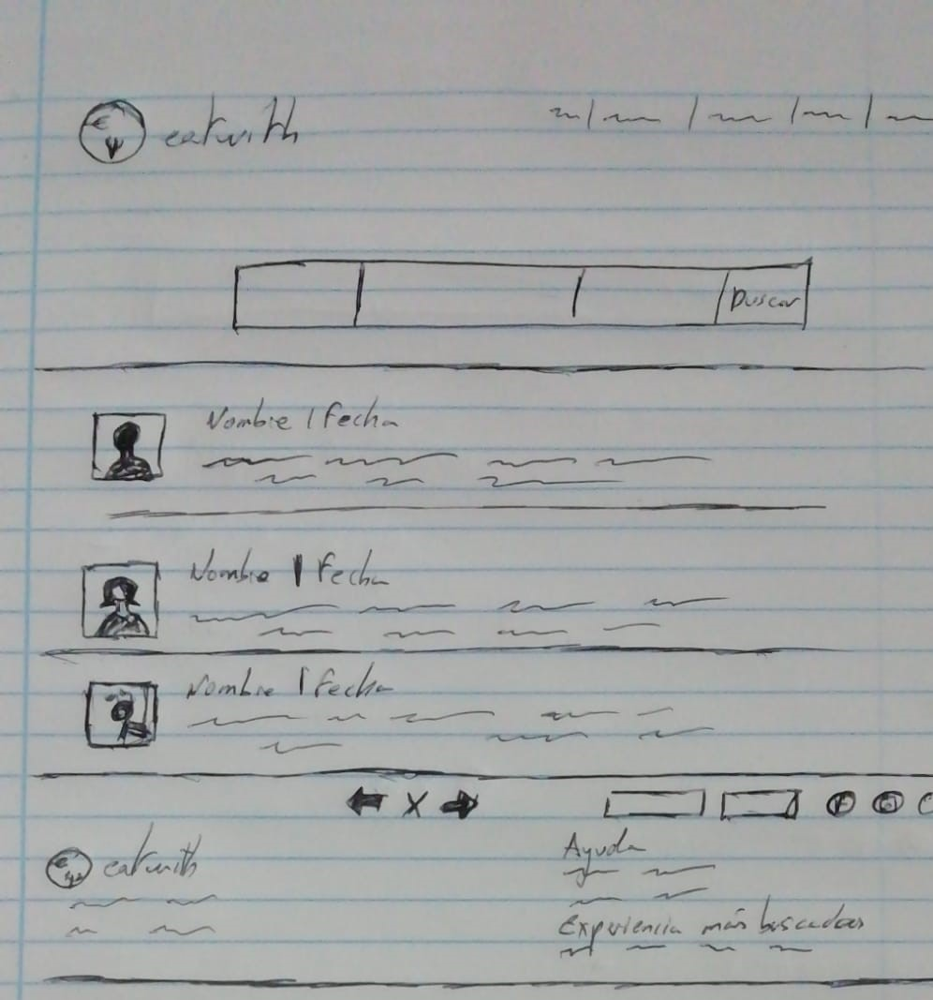
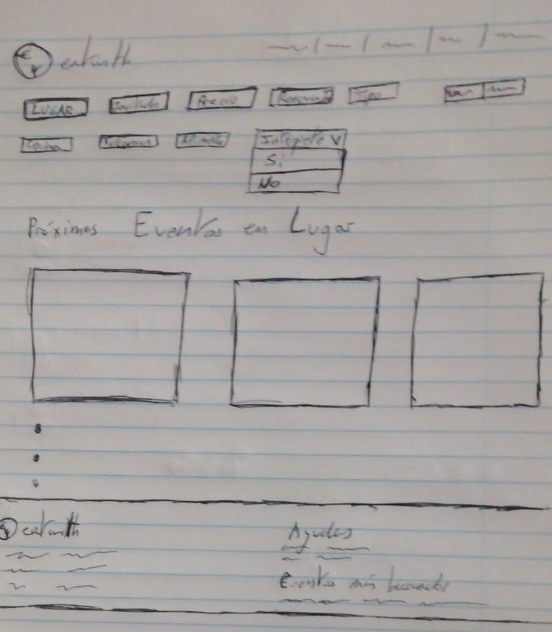
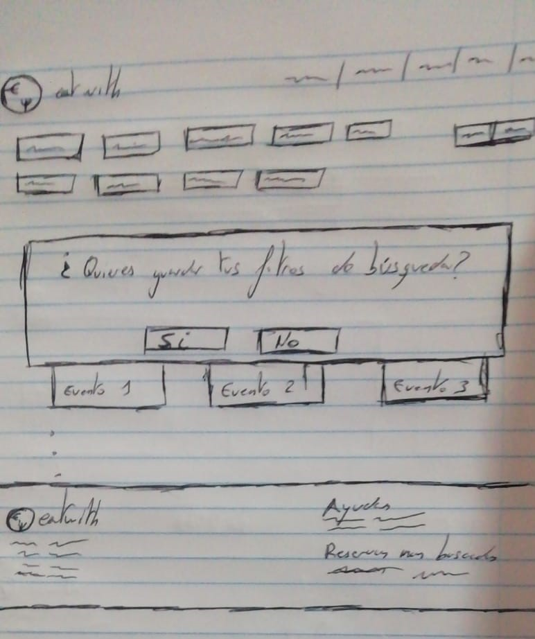

## Paso 2. UX Design  

 2.a Feedback Capture Grid
----

  
Eatwith ofrece una buena experiencia de usuario, con una interfaz clara y una información en lo general bien estructurada. El usuario dependiendo de lo que quiera hacer tiene las funcionalidades a mano, con la información clara y precisa sobre en qué consiste cada apartado. Sin embargo, en el usability review descubrimos ciertos errores que se podrían mejorar añadiendo o modificando ciertos detalles de la página. El ejemplo más claro lo encontramos en el panel de ayuda, que a pesar de estar constantemente en la pantalla, cuesta discernir qué es. Aparece con un símbolo que parece parte del fondo y no una pestaña emergente. Esto se podría mejorar cambiando el simbolo de ayuda e lugar o poniendo otro más clarificador. Otra función que podríamos añadir sería un foro o un sistema de mensajes entre usuarios para formar grupos antes de las quedadas, para ir conociendo gente antes y después de los eventos o para pedir recomendaciones. Por último, hemos pensado que poder guardar busquedas con filtros sería útil para así evitar hacer la busqueda entera y ahorrar tiempo.

 2.b Tasks & Sitemap 
-----

 

 2.c Labelling 
----

 

Término | Significado     
| ------------- | -------
  Tarjeta Regalo | Comprarle a otra persona un vale para canjear
  Eventos Privados | Buscar un evento con un anfitrion especifico
  Reservar Evento | Reservar plaza en evento
  Se anfitrión | Convertirse en el anfitrión de un evento
  Perfil | Acceder a tu perfil
  Mensajes |  Acceder a tus mensajes privados
  Reservas efectuadas|  Consultar reservas anteriores o pendientes
  Mis eventos favoritos | Consultar eventos marcados como favoritos
  Mi cuenta | Acceder a las opciones de tu cuenta
  Recomiendo a un amigo | Poder enviarle a un amigo un enlace de la pagina
  ¿Cómo funciona? | Informacion basica sobre el uso de la pagina
  Foros | Acceso a los foros
  Ayudas | acceso al soporte tecnico

 2.d Wireframes
-----

Foro:

-----
Interprete:
-----

-----
Guardar filtros:
-----

