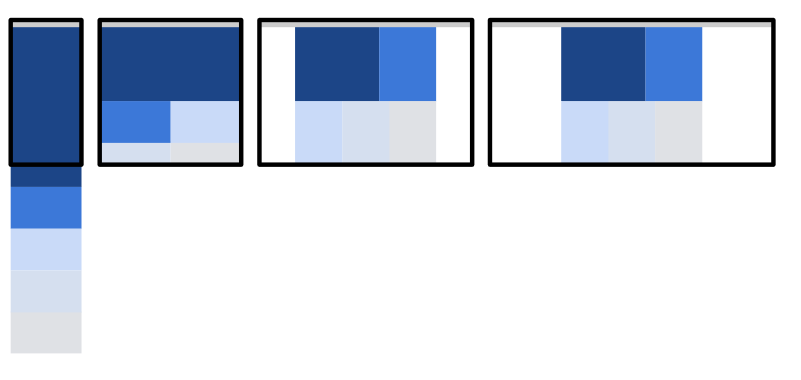

# 1.- Analiza:

-Pregunta  seminal/idea  de  investigación: Una buena forma de empezar una exposición y atraer al público es hacer una pregunta que nos hemos hecho todo en algun momento, en este caso quedarnos fascinados mirando arte por la calle y preguntarnos quién es el autor de la obra. Con esto captamos la atención de nuestro publico con el tema del que queremos hablar.

Introducción: La misma pregunta les lleva a la creación del proyecto con un objetivo claro: darle mas importancia a aquellas obras públicas y anónimas.

Oportunidad: Es una idea muy buena ya que no hemos visto personalmente ninguna aplicación que trate de dar visibilidad a el arte anónimo y callejero. Siempre se le da más importancia a monumentos o estructuras históricas, dejando de lado al arte más urbano. Tienen claro como llevar a cabo la idea ya que utilizan mapas interactivos, juegos interactivos , redes sociales y demás que dan la oportunidad al usuario de aprender cosas del arte que tienen enfrente.

Investigación primaria: Primero tuvieron una reunión para ver qué necesidades e inquietudes tienen los posibles usuarios de la aplicación, por lo que fueron a varios lugares de interés para estudiar como interactúan las personas con las obras de arte callejeras. Esta práctica está bien pensada porque un desarrollador puede tener una idea preconcebida sobre el uso que puede tener su aplicación, pero las personas
 pueden tener otro tipo de necesidades y si no lo ves de primera mano, es posible que no consigas satisfacerlas todas.

Análisis de la competencia: Hicieron una investigación para ver que apps parecidas había en el mercado, comparando una con otras para ver que funcionalidades tenían unas u otras . Esto es importante para ver en que fallan tus competidores para así poder realizar un producto superior al de la competencia. Tuvieron en cuenta que es lo que ninguna de estas apps ofrecían, como la de recomendaciones personalizadas al usuario, para así poder incluirlo en su aplicación.

Diseño Centrado en el Usuario para recabar información: Realizaron un empathy map para así tener un primer acercamiento sobre qué pueden pensar tus usuarios y así poder abordar las entrevistas de una manera mas correcta.
Una vez realizadas estas entrevistas, realizan un affinity mapping para poner en contraste las ideas del principio con lo que han encontrado a través de la entrevista, viendo en que habian fallado o que les faltaba por añadir.
Es una buena forma de perfeccionar las futuras funcionalidades de la aplicacion.
Hicieron uso de las Personas para tener una mejor vision de como los usuarios van a utilizar su aplicación, revelando que inconvenientes se iban a encontrar. Nosotros pensamos que esta practica es muy positiva por que ayuda a mejorar la experiencia de usuario y ponerse en la piel de aquellas personas que no has tenido la posibilidad de entrevistar.
El uso de User Journey y Experience map nos sirve para poder simular los diferentes escenarios que pueden tener nuestras personas y ver como reaccionarían ante ellos. Así podemos ver que sensaciones tendrían y cómo afecta a su experiencia de usuario.
Los User Scenarios están intrínsecamente relacionados con el User Journey y el Experience map ya que podríamos ver como la aplicación podría mejorar la experiencia de la persona.

Problemas que debemos evitar, cosas que debemos incluir: Pueden surgir varios problemas que se presenten antes los usuarios, por lo que debemos estudiarlos y darles su importancia para poder mejorar la experiencia de usuario.
Los creadores hicieron una investigación en la que buscaron cual era el problema a tratar y qué podían hacer ellos para arreglarlo, realizando una hipótesis viendo como repercutiría en la experiencia a la hora de ser usada su aplicación.

Conclusión: En lineas generales nos ha parecido un UX Case Study muy bueno, en la que han llevado a cabo un estudio completo del problema, utilizando varias herramientas que le han permitido acercarse de una manera más fidedigna a las necesidades del usuario. Lo que más importante nos parecen son el análisis de competencias, porque así podemos comparar a la competencia y ver como mejorar el producto para así poder destacar, y el uso de las personas para poder contar con múltiples clientes y hacernos una idea de cómo va a ser la experiencia de usuario y así poder incidir en los puntos más lesivos.  Creemos que los métodos UX que realizan a la hora de enforcar el proyecto son bastante acertados y ayudan al desarrollo del mismo.

# 2.- Investiga patrones de diseño y guidelines:

Hemos estado estudiando varios patrones de diseño y el más atractivo que hemos encontrado es el denominado Mostly Fluid. Este patrón consiste en una cuadricula fluida, es decir, en las pantallas más grandes se mantiene el mismo tamaño con unos margenes laterales mas anchos.
En pantallas más pequeñas la cuadricula fluida genera el reprocesamiento del contenido principal, mientras que las columnas se apilan verticalmente. Esto hace que solo se necesite un punto de interrupción entre las pantallas grandes y las pequeñas, haciendo su implementación y su diseño más sencillo.
Hemos escogido este patrón porque es un patrón sencillo, que funciona tanto en dispositivos móviles como en pantallas de mayor resolución, ofreciéndonos versatilidad.

Así sería como quedaría en diferentes resoluciones:

En cuanto a los colores, Android nos ofrece una paleta de colores para usar, aunque nos recomiendan usar el azul. Es importante que los colores hagan un buen contraste y que no sea incomodo de ver, ya que puede afectar negativamente en la experiencia de usuario.

Las letras deben tener una fuente normal y correcta, y una tener un tamaño adecuado para la lectura.

En cuanto a la pagina web sería una pagina sencilla, con un header que contendría el logo de la pagina web con el titulo, en el cual si pulsas te vuelve a llevar a la pagina principal. Esto serviría para poder volver de una forma rápida a la página de inicio si estás en una subpagina de la web.
El header además tendría un menú desde el que puedes ir a cualquier funcionalidad de la web de manera rápida y sencilla. Para poder hacer búsquedas, tendríamos una barra de navegación en la pagina principal para poder realizar búsquedas personalizadas. Una vez has iniciado la búsqueda, el buscador seguiría estando disponible para poder cambiar filtros o añadir nuevos criterios de búsqueda.  

A la hora de hacer las reservas o la creación de eventos en nuestra aplicación usaríamos los conocidos como Progress Trackers , que sirve para poder diferenciar diferentes apartados de un mismo proceso. Esto conseguiría que el usuario sepa en cada paso qué debe hacer y evitaría errores de entendimiento

Sería algo así, con diferentes apartado en los que ir avanzando:

En el footer tendríamos un apartado de ayuda para los usuarios que la necesiten, que este accesible y sea intuitiva. Tendríamos además botones a las redes sociales de la web y un copyight de la empresa.

# Video de la historia

Este es el enlace: https://youtu.be/k8pgWPt0wF8

# Conclusión

Francamente lo que más nos ha costado ha sido grabar el video como tal, ya que explicar algo como si fuera una historia en tan poco tiempo ha sido bastante complicado (en todas las pruebas que hicimos salía un video de 3-4 minutos). En cuanto al estudio de MuseMap fue interesante ver como estos chicos pasaron de una idea a llevar a cabo una aplicación de exito, viendo las etapas y como fué el desarrollo como tal de la aplicación.
