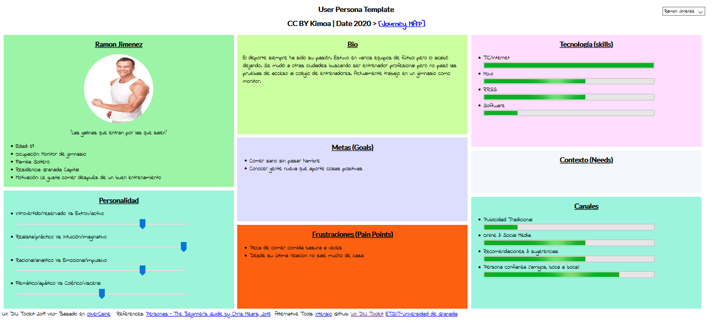
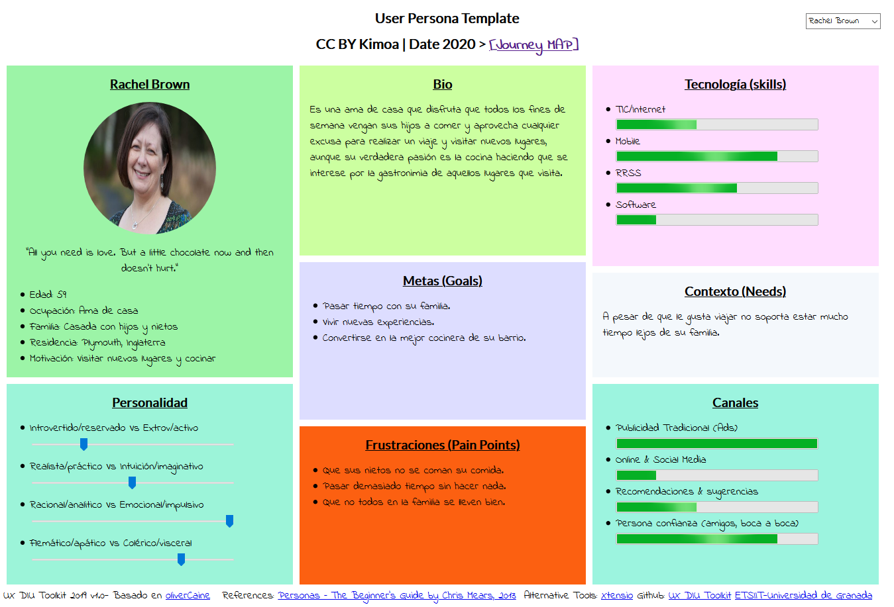
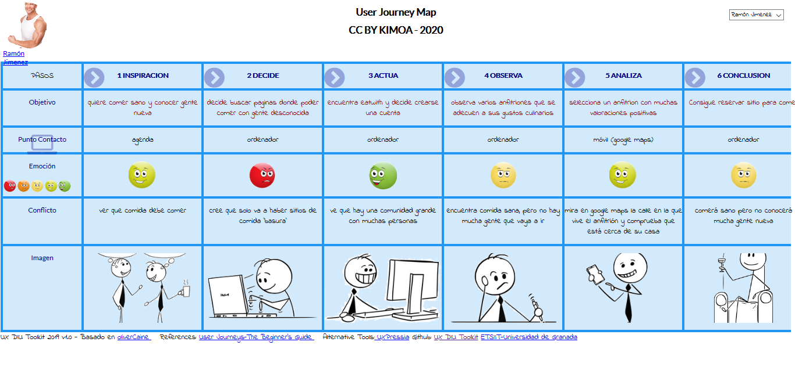
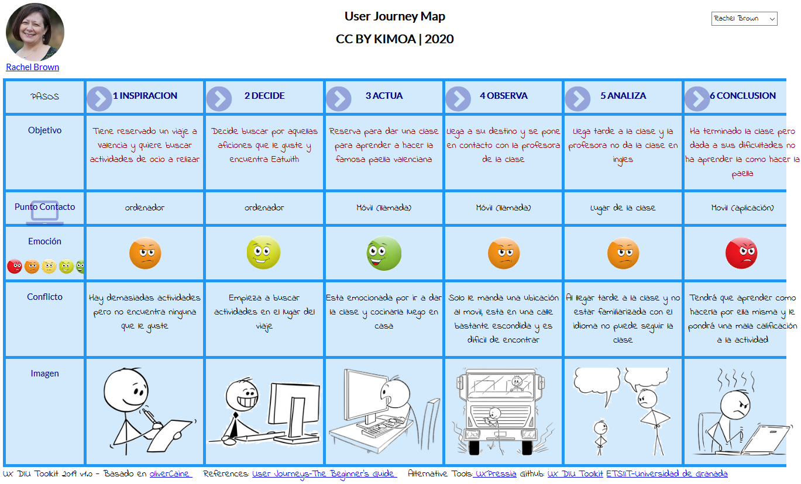
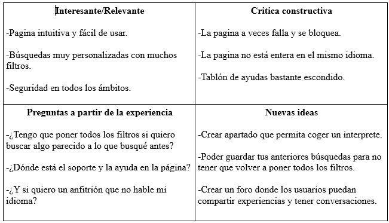
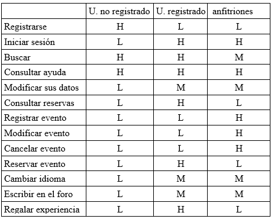

# DIU20
Prácticas Diseño Interfaces de Usuario 2019-20 (Economía Colaborativa) 

Grupo: DIU3_KIMOA .  Curso: 2019/20 

Proyecto: 

Descripción: 

Logotipo: 

Miembros
 * :bust_in_silhouette:   Bryan Alfonso Córdoba Góngora     :octocat:     
 * :bust_in_silhouette:  Álvaro Répole Alonso     :octocat:

----- 

En esta práctica estudiaremos un caso de plataforma de economía colaborativa y realizaremos una propuesta para su diseño Web/movil. Utilizaremos herramientas y entregables descritos en el siguiente CheckList (https://github.com/mgea/UX-DIU-Checklist) 

Qué es economia colaborativa: Martínez-Polo, J. (2019). **El fenómeno del consumo colaborativo: del intercambio de bienes y servicios a la economía de las plataformas**, *Sphera Publica, 1*(19), 24-46. http://sphera.ucam.edu/index.php/sphera-01/article/view/363/14141434

>>> Este documento es el esqueleto del report final de la práctica. Aparte de subir cada entrega a PRADO, se debe actualizar y dar formato de informe final a este documento online. 

# Proceso de Diseño 

## Paso 1. UX Desk Research & Analisis 

 1.a Competitive Analysis
----- 
Tenemos que mirar aplicaciones que permitan compartir ocio con otras personas. Tras una busqueda por varias webs, en las que hemos visto sitios para contratar músicos para una velada como Sofar o Artery, nos hemos acabado decantado por EatWith, una aplicación que te permite hacer tours gastronómicos, dar clases de cocina local con otras personas o reservar mesa en casas particulares para hacer comidas grupales y poder conocer gente.
A la hora de comparar Eatwith con Sofar por ejemplo vemos que en EatWith podemos hacer búsquedas más filtradas, que estén más adecuadas a lo que estamos buscando. Eatwith ofrece más información a primera vista que Sofar, proporcionando al usuario una mejor navegabilidad.
Tambien hemos comparado Eatwith con Artery, en la que encontramos más diferencias. En Artery cuesta relativamente encontrar las cosas, incluso qué proposito tiene la página web. En el aspecto de sencillez y de presentación, Eatwith es bastante superior.
Eatwith ofrece en definitiva una rapida y sencilla navegación, siendo accesible para todo tipo de usuarios. Su interfaz es intuitiva y sus opciones estan bien definidas no dando lugar a errores de interpretación. Tiene una buena estructura (bastante mejor que la de The Artery por ejemplo), con lo que encontrar sus funcionalidades en sencillo.
Además, han tenido excelentes criticas por la prensa especializada, haciendo gala de ellos en el fondo del cuerpo de la página.

 1.b Persona
-----
La primera persona es la representación del usuario medio, con intentción de comer sano y conocer gente cerca de casa, disfrutando de la gastronomía local. Está acostumbrado a las tecnologías y sabe lo que está buscando.

La segunda persona es la representación de una mujer inglesa que conoce algo de uso en las tecnologias pero aun asi tampoco se desenvuelve con facilidad y le gusta viajar.Esta persona le gusta realizar sus pasión la cocina y pasar tiempo con su familia, he escogido esta persona porque queria una extrajera de edad avanzada que no se moviese tan bien con las tecnologías.

 1.c User Journey Map
----
En el caso de Ramón Jimenez vemos cómo sería un caso relativamenete normal de alguien que busca en eatwith un anfitrión con quién comer. Encuentra un tipo de comida que le gusta pero no va mucho gente a comer, por lo que no satisfase su necesidad del todo

La experiencia de Rachel Brown aunque inusual, puede pasar. Ella se encuentra en un pais extranjero, tiene la dificultad con el idioma y poca comunicación con su anfitrión. Además tiene dificultades encontrando la calle, por lo que su experiencia queda gravemente perjudicada.

 1.d Usability Review
----
Es una página consistente que ofrece al usuario una experiencia satisfactoria. Para personas con experiencia navegando por la red podrán moverse y tocar las diferentes opciones que la misma página da al usuario para satisfacer sus necesidades, las personas que no esten acustrabadas a moverse por estas páginas se le proporcionaran unos valores por defecto a la hora de buscar para que el usuario solo tenga que introducir unos datos básicos para realizar sus consultas.

## Paso 2. UX Design  

 2.a Feedback Capture Grid
----

  
Eatwith ofrece una buena experiencia de usuario, con una interfaz clara y una información en lo general bien estructurada. El usuario dependiendo de lo que quiera hacer tiene las funcionalidades a mano, con la información clara y precisa sobre en qué consiste cada apartado. Sin embargo, en el usability review descubrimos ciertos errores que se podrían mejorar añadiendo o modificando ciertos detalles de la página. El ejemplo más claro lo encontramos en el panel de ayuda, que a pesar de estar constantemente en la pantalla, cuesta discernir qué es. Aparece con un símbolo que parece parte del fondo y no una pestaña emergente. Esto se podría mejorar cambiando el simbolo de ayuda e lugar o poniendo otro más clarificador. Otra función que podríamos añadir sería un foro o un sistema de mensajes entre usuarios para formar grupos antes de las quedadas, para ir conociendo gente antes y después de los eventos o para pedir recomendaciones. Por último, hemos pensado que poder guardar busquedas con filtros sería útil para así evitar hacer la busqueda entera y ahorrar tiempo.

 2.b Tasks & Sitemap 
-----

 

 2.c Labelling 
----

>>> Identificar términos para diálogo con usuario  

Término | Significado     
| ------------- | -------
  Tarjeta Regalo | Comprarle a otra persona un vale para canjear
  Eventos Privados | Buscar un evento con un anfitrion especifico
  Reservar Evento | Reservar plaza en evento
  Se anfitrión | Convertirse en el anfitrión de un evento
  Perfil | Acceder a tu perfil
  Mensajes |  Acceder a tus mensajes privados
  Reservas efectuadas|  Consultar reservas anteriores o pendientes
  Mis eventos favoritos | Consultar eventos marcados como favoritos
  Mi cuenta | Acceder a las opciones de tu cuenta
  Recomiendo a un amigo | Poder enviarle a un amigo un enlace de la pagina
  ¿Cómo funciona? | Informacion basica sobre el uso de la pagina
  Foros | Acceso a los foros
  Ayudas | acceso al soporte tecnico

 2.d Wireframes
-----

>>> Plantear el  diseño del layout para Web/movil (organización y simulación ) 

## Paso 3. Make (Prototyping) 

 3.a Moodboard
-----

>>> Plantear Diseño visual con una guía de estilos visual (moodboard) 

  3.b Landing Page
----

>>> Plantear Landing Page 

 3.c Guidelines
----

>>> Estudio de Guidelines y Patrones IU a usar 

  3.d Mockup
----

>>> Layout: Mockup / prototipo HTML  (que permita simular tareas con estilo de IU seleccionado)

## Paso 4. UX Check (Usability Testing) 

 4.a A/B Testing
----

>>> Comprobacion de asignaciones para A/B Testing. Asignaciones https://github.com/mgea/DIU19/blob/master/ABtesting.md

>>>> Práctica A: 

 4.b User Testing
----

>>> Usuarios para evaluar prácticas 

| Usuarios | Sexo/Edad     | Ocupación   |  Exp.TIC    | Personalidad | Plataforma | TestA/B
| ------------- | -------- | ----------- | ----------- | -----------  | ---------- | ----
| User1's name  | H / 18   | Estudiante  | Media       | Introvertido | Web.       | A 
| User2's name  | H / 18   | Estudiante  | Media       | Timido       | Web        | A 
| User3's name  | M / 35   | Abogado     | Baja        | Emocional    | móvil      | B 
| User4's name  | H / 18   | Estudiante  | Media       | Racional     | Web        | B 

. 4.c Cuestionario SUS
----

>>> Usaremos el **Cuestionario SUS** para valorar la satisfacción de cada usuario con el diseño (A/B) realizado. Para ello usamos la [hoja de cálculo](https://github.com/mgea/DIU19/blob/master/Cuestionario%20SUS%20DIU.xlsx) para calcular resultados sigiendo las pautas para usar la escala SUS e interpretar los resultados
http://usabilitygeek.com/how-to-use-the-system-usability-scale-sus-to-evaluate-the-usability-of-your-website/)
Para más información, consultar aquí sobre la [metodología SUS](https://cui.unige.ch/isi/icle-wiki/_media/ipm:test-suschapt.pdf)

>>> Adjuntar captura de imagen con los resultados + Valoración personal 

 4.c Usability Report
----

>> Añadir report de usabilidad para práctica B 

## Paso 5. Evaluación de Accesibilidad  

  5.a Accesibility evaluation Report
----

>>> Indica qué pretendes evaluar (de accesibilidad) y qué resultados has obtenido + Valoración personal

>>> Evaluación de la Accesibilidad (con simuladores o verificación de WACG) 

## Conclusión / Valoración de las prácticas

>>> (90-150 caracteres) Opinión del proceso de desarrollo de diseño siguiendo metodología UX y valoración (positiva /negativa) de los resultados obtenidos  

