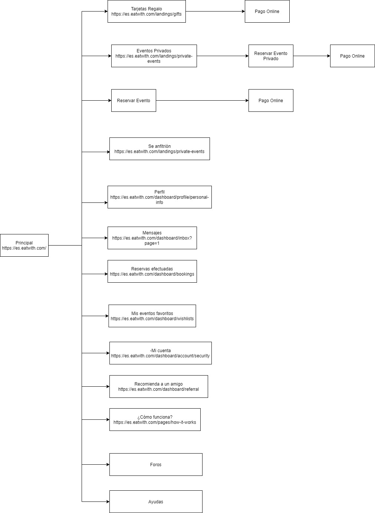
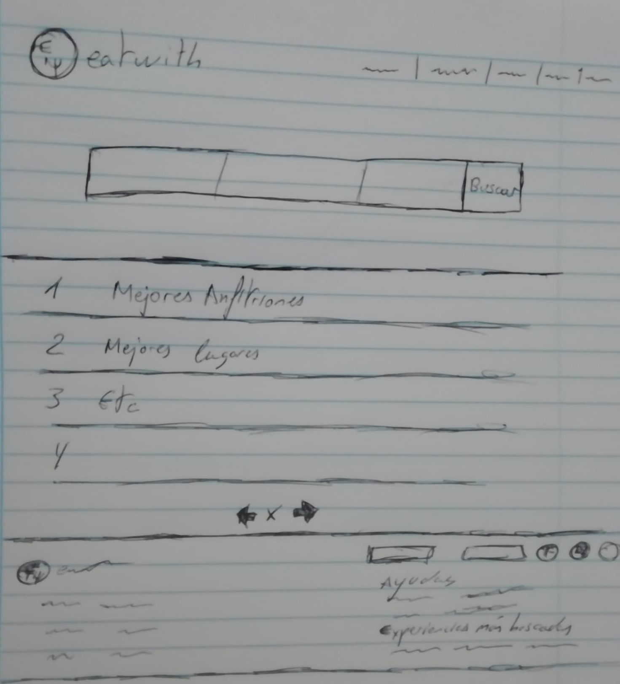
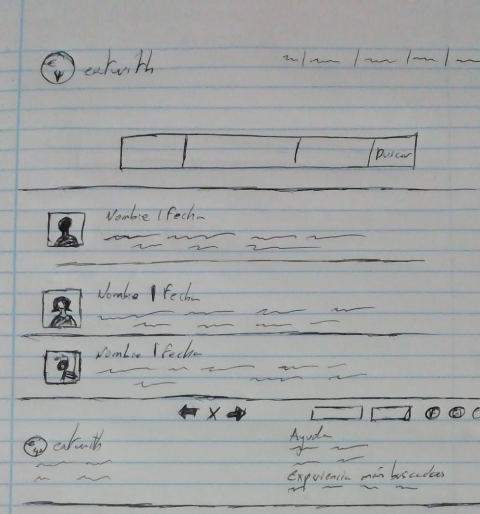
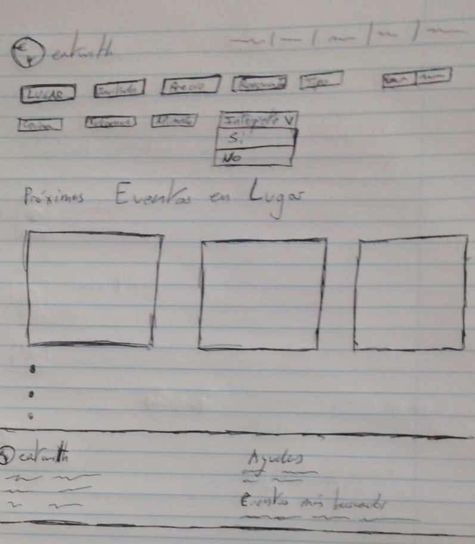
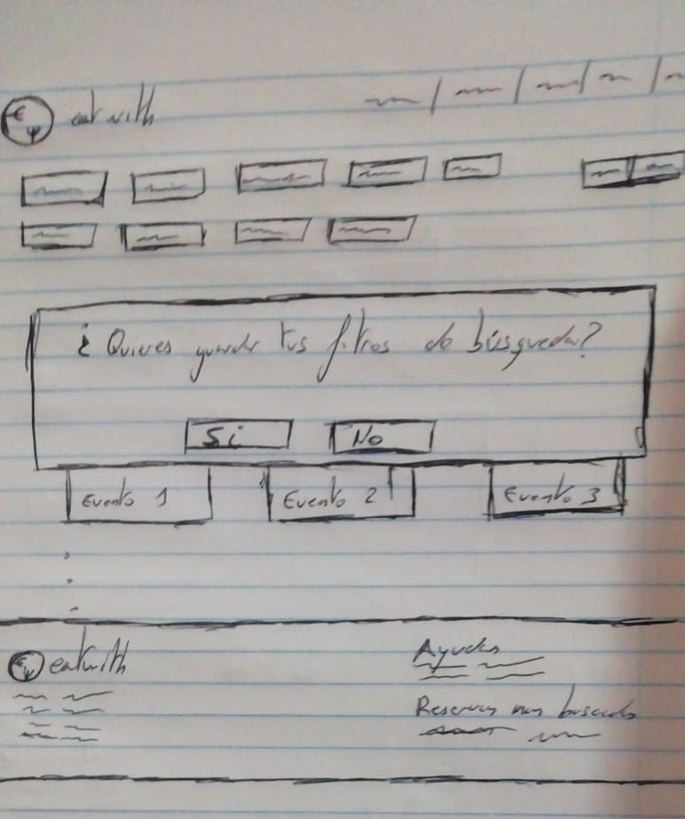

# DIU20
Prácticas Diseño Interfaces de Usuario 2019-20 (Economía Colaborativa) 

Grupo: DIU3_KIMOA .  Curso: 2019/20 

Proyecto: 

Descripción: 

Logotipo: 

Miembros
 * :bust_in_silhouette:   Bryan Alfonso Córdoba Góngora     :octocat:     
 * :bust_in_silhouette:  Álvaro Répole Alonso     :octocat:

----- 

En esta práctica estudiaremos un caso de plataforma de economía colaborativa y realizaremos una propuesta para su diseño Web/movil. Utilizaremos herramientas y entregables descritos en el siguiente CheckList (https://github.com/mgea/UX-DIU-Checklist) 

Qué es economia colaborativa: Martínez-Polo, J. (2019). **El fenómeno del consumo colaborativo: del intercambio de bienes y servicios a la economía de las plataformas**, *Sphera Publica, 1*(19), 24-46. http://sphera.ucam.edu/index.php/sphera-01/article/view/363/14141434

>>> Este documento es el esqueleto del report final de la práctica. Aparte de subir cada entrega a PRADO, se debe actualizar y dar formato de informe final a este documento online. 
-----
## ¿Alguna vez te ha invitado a comer tu amigo y has pensado que debería compartir su comida con el resto de gente?

# Introducción

Esta pregunta nos sirvió de incentivo para decantarnos a la hora de crear Eatwith. Una aplicación que permitise a los usuarios conocer gente en eventos gastronómicos, como hacer quedadas en casa de un anfitrión, ir a cursos de cocina de comida nueva o realizar tours por los diferentes bares y restaurantes de una ciudad.

## Duración del proyecto: 3 meses

## Miembros del equipo: Álvaro Répole Alonso y Bryan Alfonso Córdoba Góngora

## Objetivos:
      1. Permitir reunirse a usuarios con gustos gastronómicos similares.
      2. Permitir a los usuarios compartir experiencias, ya sea en un tour o en una comida.
      3. Fomentar la grastronomía local y crear experiencias inolvidables.

# La oportunidad

## Pudimos trabajar con:
      1. Permitir a los usuarios obtener infomación de los eventos y los anfitriones encargados de realizarla.
      2. Contamos con un sistema de votaciones para comparar los anfitriones y asi saber cuales son los mejores.
      3. Diferentes metodos de pago y confirmación de la reserva.
      4. Filtros que te indican cuales son los mejores eventos de una zona basado en tus gustos.
      5. Tarjetas de regalo que permitiran invitar a otros usuarios.
      
# Investigación del usuario

Antes de realizar las entrevistas tuvimos una reunión en la que nos centramos en suponer cuales serian nuestros usuarios y que necesitarían de nuestra aplicación. De la reunion sacamos las siguientes ideas:

Nuestros usuarios desean compartir sus experiencias gastronómicas con otros usuarios.

Los usuarios desean realizar difirentes talleres gastronómicos.

Los anfitriones desean sacar algo de dinero de las experiencias.

La mayoria de clientes le interesan las experiencias gastronomicas pero al no encontrar información sobre ellas desiste.

# Investigación contextual 

Decidimos constatar nuestra suposiciones visitando diferentes restaurantes y anfitriones para comprobar como actuaban los usuarios a la hora de encontrarse directamente con la experiencia. Pudimos observar que:

-Un gran porcentaje de los usuarios son extrajeros.

-El precio de las diferentes actividades no suele ser muy elevado.

-Los usuarios suelen buscar experiencias exóticas a no ser que sean extranjeros que se interesan mas por la gastronomía local.

 Competitive Analysis
----- 
Despues de comprobar como actuaban los usuarion teniamos que mirar aplicaciones que permitan compartir ocio con otras personas las cuales serían nuestras principales competidoras. Tras una busqueda por varias webs, en las que hemos visto sitios para contratar músicos para una velada como Sofar o Artery, nos hemos acabado decantado por EatWith, una aplicación que te permite hacer tours gastronómicos, dar clases de cocina local con otras personas o reservar mesa en casas particulares para hacer comidas grupales y poder conocer gente.
A la hora de comparar Eatwith con Sofar por ejemplo vemos que en EatWith podemos hacer búsquedas más filtradas, que estén más adecuadas a lo que estamos buscando. Eatwith ofrece más información a primera vista que Sofar, proporcionando al usuario una mejor navegabilidad.
Tambien hemos comparado Eatwith con Artery, en la que encontramos más diferencias. En Artery cuesta relativamente encontrar las cosas, incluso qué proposito tiene la página web. En el aspecto de sencillez y de presentación, Eatwith es bastante superior.
Eatwith ofrece en definitiva una rapida y sencilla navegación, siendo accesible para todo tipo de usuarios. Su interfaz es intuitiva y sus opciones estan bien definidas no dando lugar a errores de interpretación. Tiene una buena estructura (bastante mejor que la de The Artery por ejemplo), con lo que encontrar sus funcionalidades en sencillo.
Además, han tenido excelentes criticas por la prensa especializada, haciendo gala de ellos en el fondo del cuerpo de la página.

## Entrevistas de usuario:

Publicamos las encuestas para seleccionar a las personas para llevar a cabo las entrevistas, en ellas nos dimos cuenta que se repetian ciertas frases:

"Me encanta ir a un sitio nuevo y que me sorprendan con la comida a la vez que disfruto de una gran velada."

"Me cuesta ir a cenar con mis amigos ya que ellos no comparten mis gustos."

"Los fines de semana me gusta dejarme llevar y que me sorprendan con una buena cena."

 Personas de usuario
----- 
Sentimos que necesitábamos crear 2 personas para identificar las metas y los puntos débiles de nuestro usuario objetivo.

La primera persona es la representación del usuario medio, con intención de comer sano y conocer gente cerca de casa, disfrutando de la gastronomía local. Está acostumbrado a las tecnologías y sabe lo que está buscando.

La segunda persona es la representación de una mujer inglesa que conoce algo de uso en las tecnologias pero aun asi tampoco se desenvuelve con facilidad y le gusta viajar.Esta persona le gusta realizar sus pasión la cocina y pasar tiempo con su familia, he escogido esta persona porque queria una extrajera de edad avanzada que no se moviese tan bien con las tecnologías.

## Objetivos del usuario
Identificamos las principales metas de nuestras personas:

Conocer gente con los mismo gustos y aficiones.

Aprender sobre la gastronomía locas y vivir experiencias únicas.

Compartir sus experiencias en las redes sociales.

## Los puntos debiles
Por otra parte podemos identificar sus puntos debiles a la hora de usar la aplicación:

El uso de las nuevas tecnologías.

Que el idioma utilizado no sea su primer idioma.

Socializar con personas que conoces por primera vez

 User Journey Map
----
Deseamos crear un mapa de viaje para ambas personas. Estudiarlos en diferentes escenarios y comprobar como se desenvolverían usando la aplicación :

En el caso de Ramón Jimenez vemos cómo sería un caso relativamenete normal de alguien que busca en eatwith un anfitrión con quién comer. Encuentra un tipo de comida que le gusta pero no va mucho gente a comer, por lo que no satisfase su necesidad del todo

La experiencia de Rachel Brown aunque inusual, puede pasar. Ella se encuentra en un pais extranjero, tiene la dificultad con el idioma y poca comunicación con su anfitrión. Además tiene dificultades encontrando la calle, por lo que su experiencia queda gravemente perjudicada.

# Diseño

Decidimos primero crear una matriz de tareas/usuarios diferenciando 3 tipos de usuarios: No registrados, registrados y anfitriones. Nos interesaba saber que acciones tendrían mas importancia para a la hora de diseñar la página darle mas valor a aquellas acciones que realicen todos los tipos de usuarios y tenga mas relevancia.

-----
Una vez creada la matriz decidimos crear el mapa (sitemap) junto a su etiquetado (labelling) para estructurar la web. En nuestro caso contamos con una página principal que nos redirecciona a las distintas funciones de la página teniendo en cuenta la busqueda de experiencias como principal acción de la aplicación.

 

Término | Significado     
| ------------- | -------
  Tarjeta Regalo | Comprarle a otra persona un vale para canjear
  Eventos Privados | Buscar un evento con un anfitrion especifico
  Reservar Evento | Reservar plaza en evento
  Se anfitrión | Convertirse en el anfitrión de un evento
  Perfil | Acceder a tu perfil
  Mensajes |  Acceder a tus mensajes privados
  Reservas efectuadas|  Consultar reservas anteriores o pendientes
  Mis eventos favoritos | Consultar eventos marcados como favoritos
  Mi cuenta | Acceder a las opciones de tu cuenta
  Recomiendo a un amigo | Poder enviarle a un amigo un enlace de la pagina
  ¿Cómo funciona? | Informacion basica sobre el uso de la pagina
  Foros | Acceso a los foros
  Ayudas | acceso al soporte tecnico

-----
Una vez terminado el mapa decidimos crear unos bocetos de algunas de las funcionalidades, tuvimos en cuenta aquellas recomendaciones que nos hicieron las personas que entrevistamos. Siempre teniendo en cuenta que el buscador debe ser visible en todo momento.

A) Entre ellas muchos comentaron querer un foro para poder compartir sus experiencias y sobretodo comentar cuales eran sus anfitriones favoritos.

-----
B) Al observar que muchos usuarios son extranjeros decidimos que incluir una opción interprete. Para permitir a aquellos usuarios que no entienden el idioma local disfrutar de la experiencia, decidimos incluirlo al lado de los otros filtros.

-----

C) Lo que si escuchamos mucho en las entrevistas era que se quejaban de que a lo mejor recargaban la página o lo cerraban porque tenían que irse, al volver tenian que introducir todos los datos de nuevos. Asi que decidimos que despues de una busqueda se le preguntase al usuario si deseaba guardar esos filtros para poder mandarle recomendaciones y que solo hiciese falta introducir la zona.

